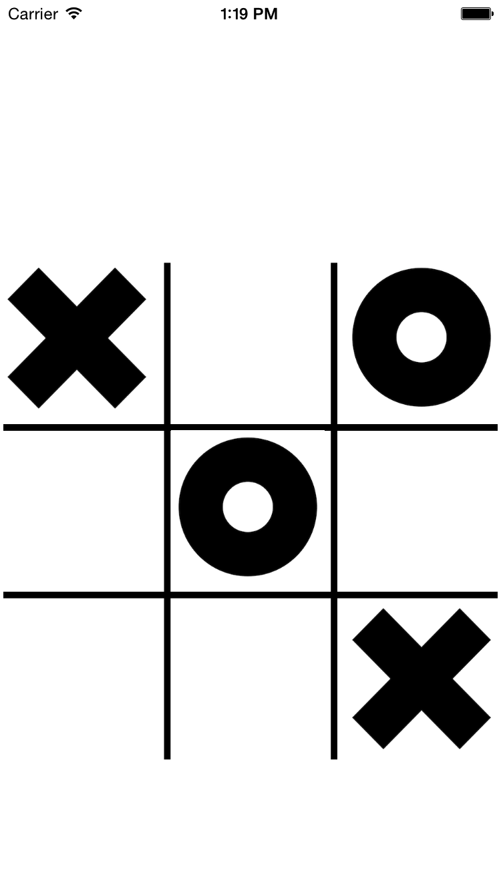
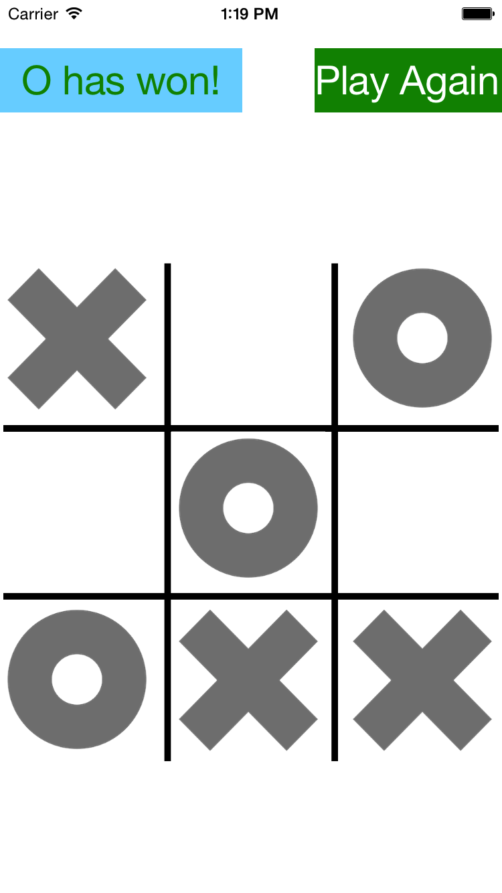

# Tic-Tac-Toe
Play the classic game Tic-Tac-Toe.

The game is currently only local 2 players. First player is X.

### Screenshot

### Works on
The app is written in Swift 3, and should run on most devices running iOS 8 or later, with some potential exceptions, as some features may not be available in versions before iOS 10.
